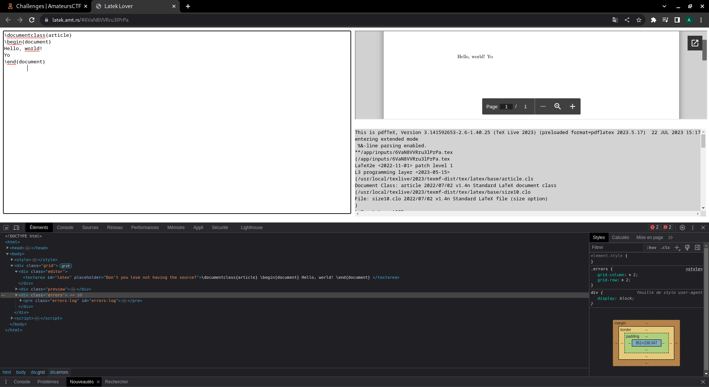
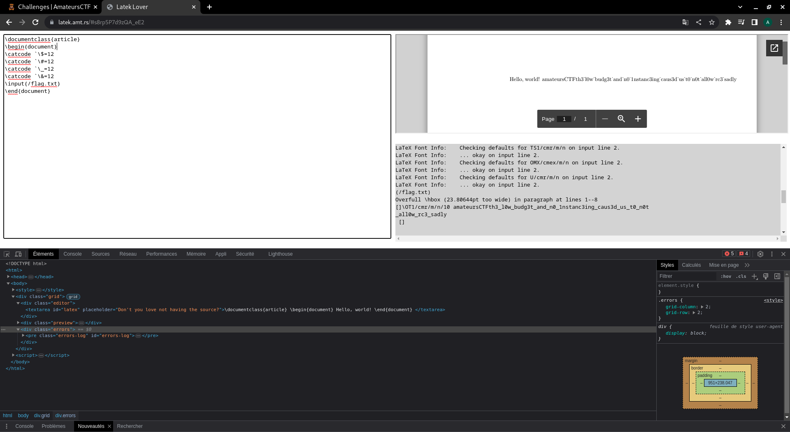

<h1>Latek</h1>

In this challenge we have no source code provided but the presentation of the challenge can give us a clue on a language to use therefore a potential vulnerability : 

<i>"bryanguo (not associated with the ctf), keeps saying it's pronouced <B>latek not latex </B>like the glove material. anyways i made this simple app so he stops paying for overleaf"</i>

With the hint given in the presentation, we can already guess that the web server uses the language <a href="https://fr.wikipedia.org/wiki/LaTeX"><B>LaTex</B></a>,
 so potentially the vulnerability to be exploited is a LaTex injection.

The main page of the site is composed of 3 parts. A first part to write text, a second part which is the text written previously but transfer in a pdf (usefulness of LaTex language) and the last part which seems to be a log file.

As we know that the language used is LaTex we can look for known exploits, and we can find several interesting links on LaTex injection including: <a href="https://github.com/swisskyrepo/PayloadsAllTheThings/tree/master/LaTeX%20Injection">LaTex injection</a>

The flag given in the log file is not complete because the characters "{}" are not well decoded, but as we know the format of the flags we can easily find the flag.

<B>Flag : amateursCTF{th3_l0w_budg3t_and_n0_1nstanc3ing_caus3d_us_t0_n0t_all0w_rc3_sadly}</B>

