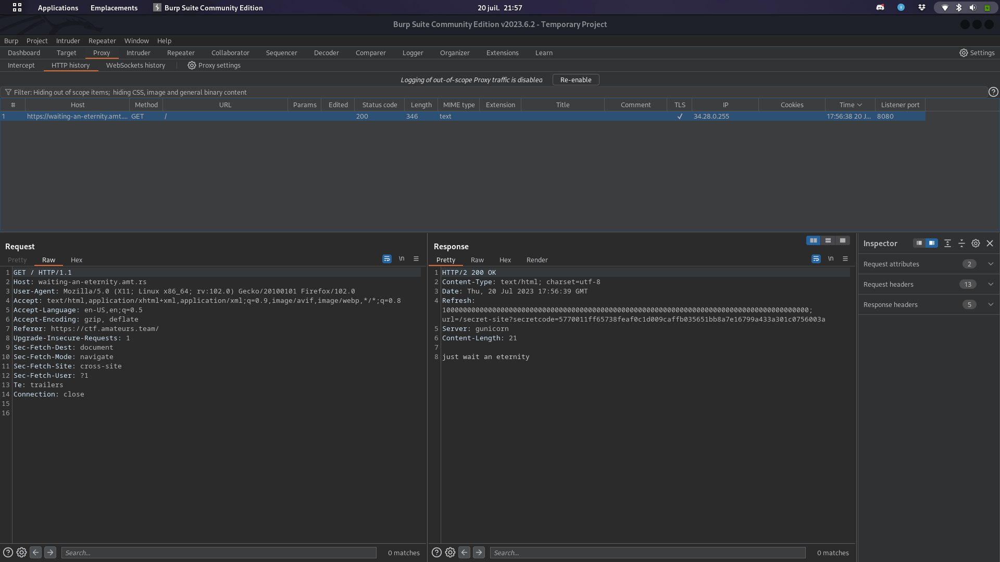
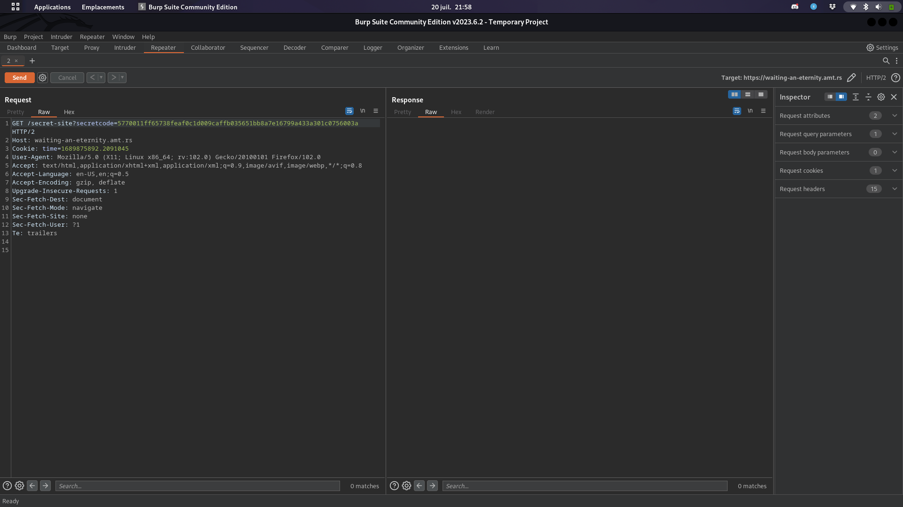
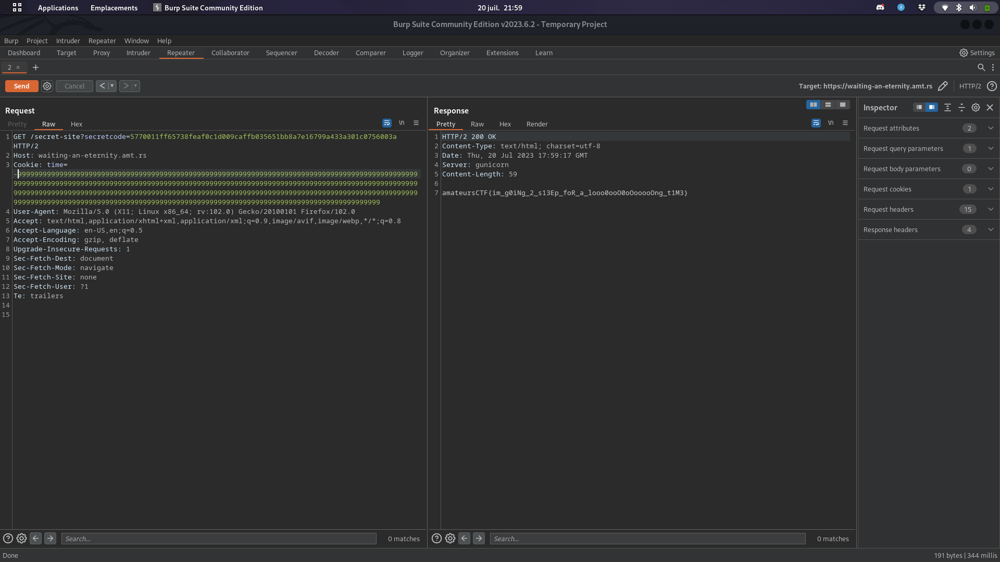

<h1> Waiting-an-eternity </h1>

In first, we can easily know with browser extensions that the site is written in python with the flask framework.

So, on the first page we can already notice an interesting element in the header of the HTTP response: <strong>"Rerefsh ... url=/secret-site?secretcode=..."</strong>

If we follow this page we come across a similar page but this time with an interesting cookie : time=xxxx.

As we know that the site is written in python, we can test to exceed the maximum number that python can manage, and we will have as an answer: "you have not waited an eternity. you have only waited -inf seconds." 

So if a positive number that exceeds python limits returns us -inf then the negative number that exceeds python limits will return us inf = infinities.

